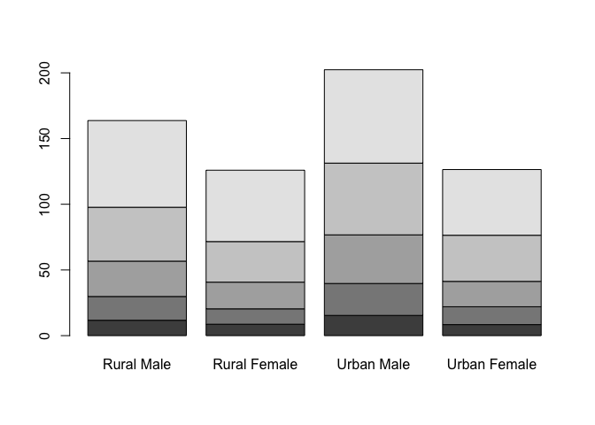
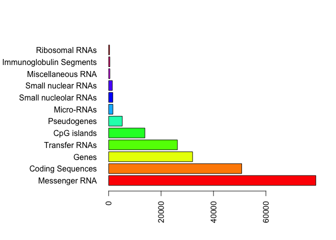

Class 5 Introduction to R graphics
================
Barry Grant
May 3rd, 2014

Class 05 R graphics intro This is some test and I can have **bold** and *italic* and `code`

``` r
# My first boxplot
x <- rnorm(1000,0)
boxplot(x)
```


``` r
summary(x)
```

    ##     Min.  1st Qu.   Median     Mean  3rd Qu.     Max. 
    ## -3.22750 -0.70887 -0.02141 -0.00187  0.70996  2.95783

``` r
hist(x)
```


``` r
boxplot(x, horizontal = TRUE)
```


I have generated x and it has 1000

``` r
# Hands on session 2

weight <- read.table("bimm143_05_rstats/weight_chart.txt", header = TRUE)

plot(weight[,1], weight[,2], typ="o")
```


``` r
plot(weight$Age, weight$Weight, typ="o", main="some main title", 
     pch=15, cex=2, col="red",
     lwd=3, lty=3)
```


``` r
# Try a barplot
barplot(VADeaths, beside = TRUE)      
```


``` r
barplot(VADeaths, beside = FALSE)      
```



``` r
## Input our feature count data
mouse <- read.table("bimm143_05_rstats/feature_counts.txt", header=TRUE, sep="\t")

barplot(mouse$Count, horiz=TRUE, names.arg = mouse$Feature, las=2)

# Change margin so we can see the labels
par(mar=c(5.1, 11.1, 4.1, 2.1))
barplot(mouse$Count, horiz=TRUE, names.arg = mouse$Feature, las=2)
```


``` r
# add some color
barplot(mouse$Count, horiz=TRUE, names.arg = mouse$Feature, las=2, col=rainbow(11))
```



``` r
# Section 3
# Using color

mf <- read.table("bimm143_05_rstats/male_female_counts.txt", sep="\t", header=TRUE)

barplot(mf$Count, names.arg = mf$Sample, col=c("red","blue"), las=2)
```


``` r
# Expresion data

e <- read.table("bimm143_05_rstats/up_down_expression.txt", header=TRUE)

# how many genes
nrow(e)
```

    ## [1] 5196

``` r
# How many up, down and all around?
table( e$State )
```

    ## 
    ##       down unchanging         up 
    ##         72       4997        127

``` r
plot(e$Condition1, e$Condition2, col=e$State)
```


``` r
# Play
palette(c("red","lightgray","blue"))
plot(e$Condition1, e$Condition2, col=e$State)
```


